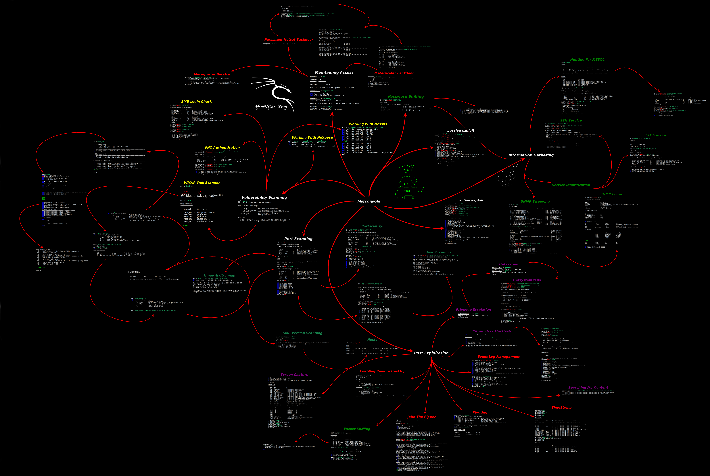
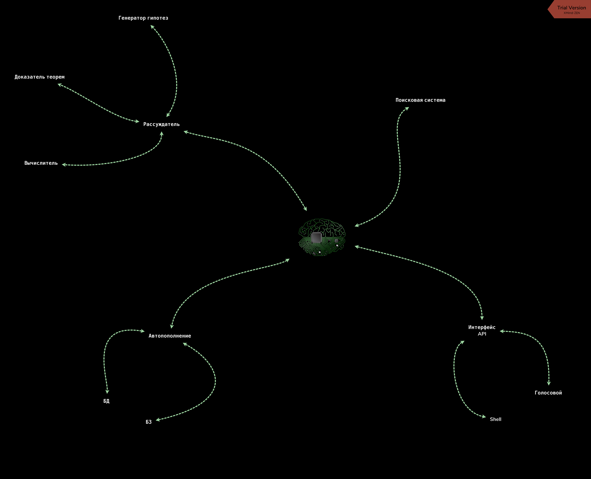
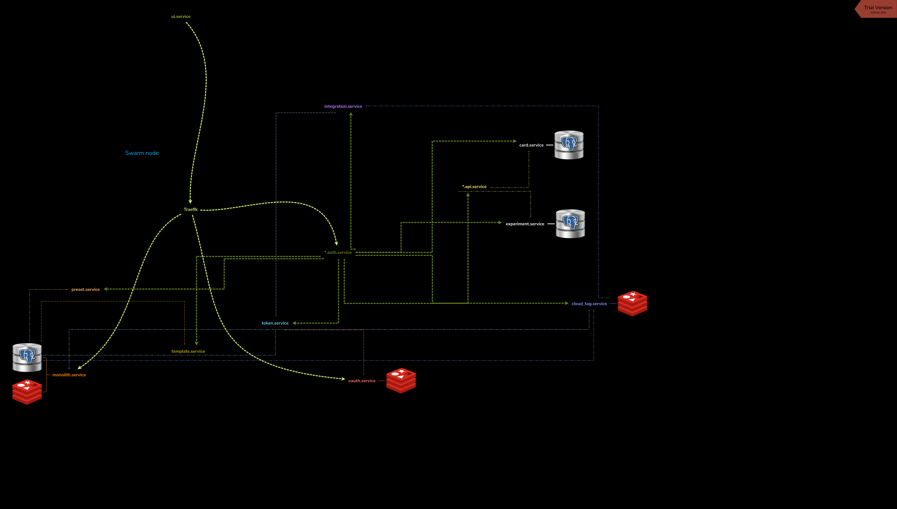
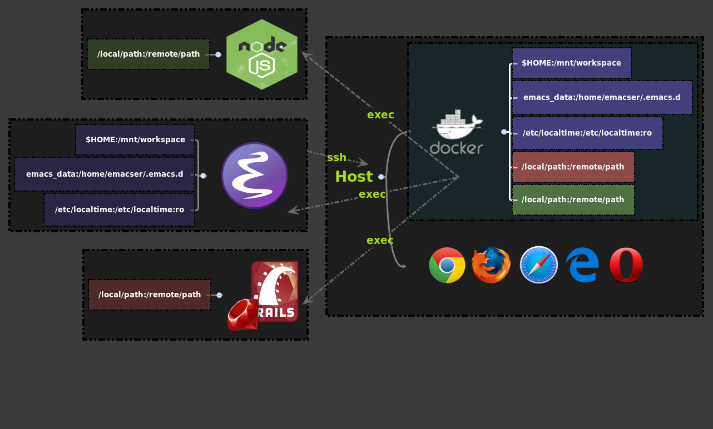

## My concept mindmaps

Includes source files built with Xmind. Some aren't finished.

My first a mind map built in university.

Second work about `msfconsole` (Metasploit Framework). Please, click `Open image in new tab`.

A mindmap summarising self-education concepts.

Base scheme AI.

Trello Power-Up concept.

Architecture Design Example with microservices.

My concept [dockerized emacs](https://github.com/AfsmNGhr/dockemacs).

